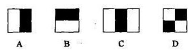
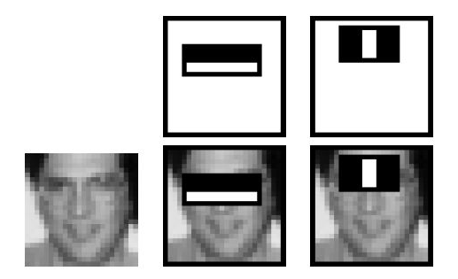
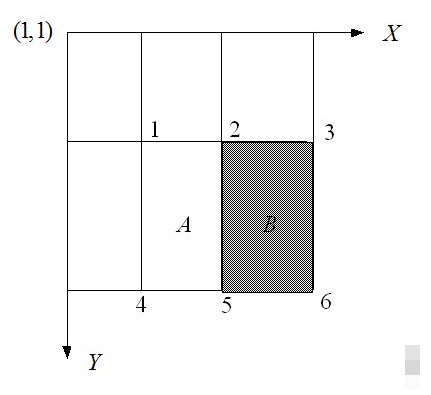
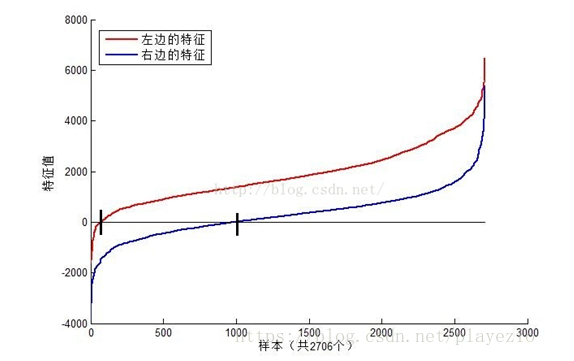
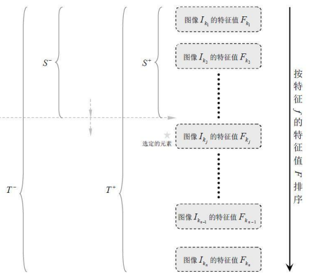
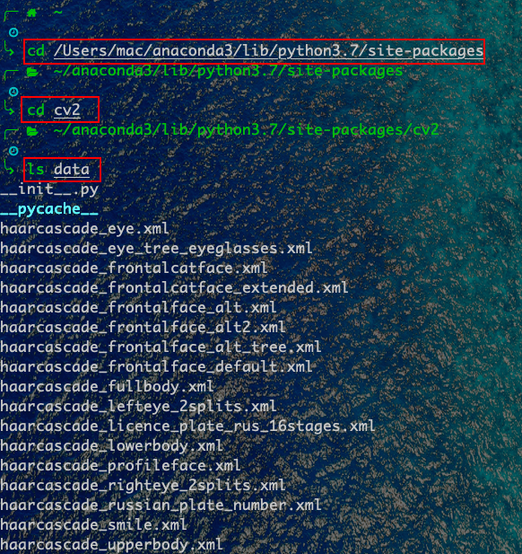
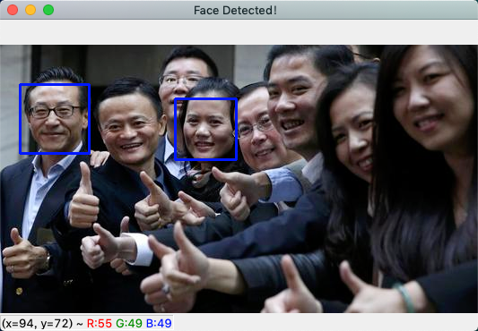

# Datawhale 计算机视觉基础-图像处理（下）-Task03 Haar特征描述算子-人脸检测

## 3.1简介
Haar-like特征最早是由Papageorgiou等应用于人脸表示，在2001年，Viola和Jones两位大牛发表了经典的《Rapid Object Detection using a Boosted Cascade of Simple Features》和《Robust Real-Time Face Detection》，在AdaBoost算法的基础上，使用Haar-like小波特征和积分图方法进行人脸检测，他俩不是最早使用提出小波特征的，但是他们设计了针对人脸检测更有效的特征，并对AdaBoost训练出的强分类器进行级联。这可以说是人脸检测史上里程碑式的一笔了，也因此当时提出的这个算法被称为Viola-Jones检测器。又过了一段时间，Rainer Lienhart和Jochen Maydt两位大牛将这个检测器进行了扩展，最终形成了OpenCV现在的Haar分类器。


## 3.2 学习目标

- 理解Haar-like特征
- 理解积分图的计算算法
- 理解使用积分图来计算Haar特征值算法
- 理解Haar特征归一化算法
- 学会使用OpenCV自带的Haar分类器进行人脸检测

## 3.3 算法理论介绍

### 3.3.1 Haar-like 特征

Haar(哈尔)特征分为三类：边缘特征、线性特征、中心特征和对角线特征，组合成特征模板。特征模板内有白色和黑色两种矩形，并定义该模板的特征值为白色矩形像素和减去黑色矩形像素和。Haar特征值反映了图像的灰度变化情况。例如：脸部的一些特征能由矩形特征简单的描述，如：眼睛要比脸颊颜色要深，鼻梁两侧比鼻梁颜色要深，嘴巴比周围颜色要深等。但矩形特征只对一些简单的图形结构，如边缘、线段较敏感，所以只能描述特定走向（水平、垂直、对角）的结构。



对于图中的A, B和D这类特征，特征数值计算公式为：v=Σ白-Σ黑，而对于C来说，计算公式如下：v=Σ白-2*Σ黑；之所以将黑色区域像素和乘以2，是为了使两种矩形区域中像素数目一致。我们希望当把矩形放到人脸区域计算出来的特征值和放到非人脸区域计算出来的特征值差别越大越好，这样就可以用来区分人脸和非人脸。

通过改变特征模板的大小和位置，可在图像子窗口中穷举出大量的特征。上图的特征模板称为“特征原型”；特征原型在图像子窗口中扩展（平移伸缩）得到的特征称为“矩形特征”；矩形特征的值称为“特征值”。



上图中两个矩形特征，表示出人脸的某些特征。比如中间一幅表示眼睛区域的颜色比脸颊区域的颜色深，右边一幅表示鼻梁两侧比鼻梁的颜色要深。同样，其他目标，如眼睛等，也可以用一些矩形特征来表示。使用特征比单纯地使用像素点具有很大的优越性，并且速度更快。

矩形特征可位于图像任意位置，大小也可以任意改变，所以矩形特征值是矩形模版类别、矩形位置和矩形大小这三个因素的函数。故类别、大小和位置的变化，使得很小的检测窗口含有非常多的矩形特征，如：在24*24像素大小的检测窗口内矩形特征数量可以达到16万个。这样就有两个问题需要解决了：

（1）如何快速计算那么多的特征？---积分图大显神通；

（2）哪些矩形特征才是对分类器分类最有效的？---如通过AdaBoost算法来训练。


### 3.3.2 **Haar-like特征的计算—积分图**

积分图就是只遍历一次图像就可以求出图像中所有区域像素和的快速算法，大大的提高了图像特征值计算的效率。

积分图主要的思想是将图像从起点开始到各个点所形成的矩形区域像素之和作为一个数组的元素保存在内存中，当要计算某个区域的像素和时可以直接索引数组的元素，不用重新计算这个区域的像素和，从而加快了计算（这有个相应的称呼，叫做动态规划算法）。积分图能够在多种尺度下，使用相同的时间（常数时间）来计算不同的特征，因此大大提高了检测速度。

积分图是一种能够描述全局信息的矩阵表示方法。积分图的构造方式是:位置（𝑖,𝑗）处的值𝑖𝑖(𝑖,𝑗)是原图像(𝑖,𝑗)左上角方向所有像素𝑓(𝑘,𝑙)的和：
$$
𝑖𝑖(𝑖,𝑗)=∑𝑘≤𝑖,𝑙≤𝑗𝑓(𝑘,𝑙)ii(i,j)=∑k≤i,l≤jf(k,l)
$$
积分图构建算法：

1、用𝑠(𝑖,𝑗)表示行方向的累加和，初始化𝑠(𝑖,−1)=0；

2、使用𝑖𝑖(𝑖,𝑗)表示一个积分图像，初始化𝑖𝑖(−1,𝑖)=0；

3、逐行扫描图像，递归计算每个像素(𝑖,𝑗)行方向的累加和𝑠(𝑖,𝑗)和积分图像𝑖𝑖(𝑖,𝑗)的值：
$$
𝑠(𝑖,𝑗)=𝑠(𝑖,𝑗−1)+𝑓(𝑖,𝑗)
$$

$$
𝑖𝑖(𝑖,𝑗)=𝑖𝑖(𝑖−1,𝑗)+𝑠(𝑖,𝑗)
$$

4、扫描图像一遍，当到达图像右下角像素时，积分图像𝑖𝑖就构建好了。

积分图构造好之后，图像中任何矩阵区域像素累加和都可以通过简单运算得到如图所示：


设D的四个顶点分别为α,β,γ,δ则D的像素和可以表示为
$$
𝐷𝑠𝑢𝑚=𝑖𝑖(α)+𝑖𝑖(β)−(𝑖𝑖(γ)+𝑖𝑖(δ))
$$
而Haar-like特征值无非就是两个矩阵像素和的差，同样可以在常数时间内完成。


### 3.3.3 计算Haar特征值

上面已经知道，一个区域的像素值的和，可以由该区域的端点的积分图来计算。由前面特征模板的特征值的定义可以推出，矩形特征的特征值可以由特征端点的积分图计算出来。以A矩形特征为例，如下图，使用积分图计算其特征值：



 

该矩形特征的特征值，由定义，为区域A的像素值减去区域B的像素值。

区域A的像素值：
$$
𝑖𝑖(5)+𝑖𝑖(1)−𝑖𝑖(2)−𝑖𝑖(4)
$$


区域B的像素值：
$$
𝑖𝑖(6)+𝑖𝑖(2)−𝑖𝑖(5)−𝑖𝑖(3)
$$


所以：该矩形特征的特征值
$$
𝑖𝑖(5)+𝑖𝑖(1)−𝑖𝑖(2)−𝑖𝑖(4)−[𝑖𝑖(6)+𝑖𝑖(2)−𝑖𝑖(5)−𝑖𝑖(3)]


=[𝑖𝑖(5)−𝑖𝑖(4)]+[𝑖𝑖(3)−𝑖𝑖(2)]−[𝑖𝑖(2)−𝑖𝑖(1)]−[𝑖𝑖(6)−𝑖𝑖(5)]
$$
所以，矩形特征的特征值，只与特征矩形的端点的积分图有关，而与图像的坐标无关。通过计算特征矩形的端点的积分图，再进行简单的加减运算，就可以得到特征值，正因为如此，特征的计算速度大大提高，也提高了目标的检测速度。

了解了特征值的计算之后，我们来看看不同的特征值的含义是什么。我们选取MIT人脸库中2706个大小为20*20的人脸正样本图像，计算如下图所示的Haar特征：


左边对应的人眼区域，右边无具体意义。



可以看到，图中2个不同Haar特征在同一组样本中具有不同的特征值分布，左边特征计算出的特征值基本都大于0（对样本的区分度大），而右边特征的特征值基本均匀分布于0两侧（对样本的区分度小）。所以，正是由于样本中Haar特征值分布不均匀，导致了不同Haar特征分类效果不同。显而易见，对正负样本区分度越大的特征分类效果越好，即红色曲线对应图中的的左边Haar特征分类效果好于右边Haar特征。

那么看到这里，应该理解了下面2个问题：

（1）在检测窗口通过平移+缩放可以产生一系列Haar特征，这些特征由于位置和大小不同，分类效果也不同；

（2）通过计算Haar特征的特征值，可以有将图像矩阵映射为1维特征值，有效实现了降维。


### 3.3.4 Haar特征值归一化(也可以采用标准归一化)

从上图我们可以发现，仅仅一个12*8大小的Haar特征计算出的特征值变化范围从-2000~+6000，跨度非常大。这种跨度大的特性不利于量化评定特征值，所以需要进行“归一化”，压缩特征值范围。假设当前检测窗口中的图像像素为𝑖(𝑥,𝑦)i(x,y)，当前检测窗口为𝑤∗ℎw∗h大小（例如上图中为20*20大小），OpenCV采用如下方式“归一化”：

1、计算检测窗口中图像的灰度值和灰度值平方和：
$$
sum=\sum i(x,y)
$$

$$
sq_{sum}=\sum i^2(x,y)
$$

 2、计算平均值：
$$
mean = \frac{sum}{w*h}
$$

$$
sq_{mean}=\frac{sq_{sum}}{w*h}
$$

3、计算归一化因子：
$$
varNormFactor=\sqrt{sq_{mean}-mean^2}
$$
4、归一化特征值：
$$
normValue=\frac{featureValue}{varNormFactor}
$$
之后使用归一化的特征值𝑛𝑜𝑟𝑚𝑉𝑎𝑙𝑢𝑒与阈值对比。


### 3.3.5 (可选) Adaboost级联分类器

前面几块内容我们分析了Haar特征，积分图、特征值计算。这里则主要分析一下2个内容：

（1）OpenCV中的Adaboost级联分类器的结构，包括强分类器和弱分类器的形式；

（2）OpenCV自带的XML分类器中各项参数，如internalNodes和leafValues标签里面的一大堆数字的意义。

#### 1、级联分类器

级联分类模型是树状结构可以用下图表示：


其中每一个stage都代表一级强分类器。当检测窗口通过所有的强分类器时才被认为是正样本，否则拒绝。实际上，不仅强分类器是树状结构，强分类器中的每一个弱分类器也是树状结构。由于每一个强分类器对负样本的判别准确度非常高，所以一旦发现检测到的目标位负样本，就不在继续调用下面的强分类器，减少了很多的检测时间。因为一幅图像中待检测的区域很多都是负样本，这样由级联分类器在分类器的初期就抛弃了很多负样本的复杂检测，所以级联分类器的速度是非常快的；只有正样本才会送到下一个强分类器进行再次检验，这样就保证了最后输出的正样本的伪正(false positive)的可能性非常低。

#### 2、级联分类器的训练

级联分类器是如何训练的呢？首先需要训练出每一个弱分类器，然后把每个弱分类器按照一定的组合策略，得到一个强分类器，我们训练出多个强分类器，然后按照级联的方式把它们组合在一块，就会得到我们最终想要的Haar分类器。


一个弱分类器就是一个基本和上图类似的决策树，最基本的弱分类器只包含一个Haar-like特征，也就是它的决策树只有一层，被称为树桩（stump）。

以20*20图像为例，78,460个特征，如果直接利用AdaBoost训练，那么工作量是极其极其巨大的。

所以必须有个筛选的过程，筛选出T个优秀的特征值（即最优弱分类器），然后把这个T个最优弱分类器传给AdaBoost进行训练。

现在有人脸样本2000张，非人脸样本4000张，这些样本都经过了归一化，大小都是20x20的图像。那么，对于78,460中的任一特征$f_i$，我们计算该特征在这2000人脸样本、4000非人脸样本上的值，这样就得到6000个特征值。将这些特征值排序，然后选取一个最佳的特征值，在该特征值下，对于特征$f_i$来说，样本的加权错误率最低。

在确定了训练子窗口中(20x20的图像)的矩形特征数量(78,460)和特征值后，需要对每一个特征$f$，训练一个弱分类器$ℎ(𝑥,𝑓,ρ,Θ)$ :
$$
h(x,f,ρ,Θ)=\begin{cases}1,   {ρf(x)<ρΘ}\\0,  {other}\end{cases}
$$


其中𝑓为特征，Θ为阈值，ρ指示不等号的方向，𝑥代表一个检测子窗口。对每个特征𝑓，训练一个弱分类器ℎ(𝑥,𝑓,ρ,Θ)，就是确定𝑓的最优阈值，使得这个弱分类器对所有的训练样本分类误差最低。

在弱分类器训练的过程中，训练采用的照片一般都是20*20左右的小图片，**弱分类器训练的具体步骤**：

1、对于每个特征 𝑓，计算所有训练样本的特征值，并将其排序：

2、扫描一遍排好序的特征值，对排好序的表中的每个元素，计算下面四个值：

计算全部正例的权重和𝑇+；

计算全部负例的权重和𝑇−；

计算该元素前之前的正例的权重和𝑆+；

计算该元素前之前的负例的权重和𝑆−；

3、选取当前元素的特征值$F_{k,j}$和它前面的一个特征值$F_{k,j-1}$之间的数作为阈值，所得到的弱分类器就在当前元素处把样本分开 —— 也就是说这个阈值对应的弱分类器将当前元素前的所有元素分为人脸（或非人脸），而把当前元素后（含）的所有元素分为非人脸（或人脸）。该阈值的分类误差为：
$$
e=min(S^++(T^--S^-),S^-+(T^+-S^+))
$$
于是，通过把这个排序表从头到尾扫描一遍就可以为弱分类器选择使分类误差最小的阈值（最优阈值），也就是选取了一个最佳弱分类器。



 

由于一共有78,460个特征、因此会得到78,460个最优弱分类器，在78,460个特征中，我们选取错误率最低的特征，用来判断人脸，同时用此分类器对样本进行分类，并更新样本的权重。

**强分类器的训练步骤：**

1.、给定训练样本集$\left(x_{i}, y_{i}\right), i=1,2,3, \ldots N$,共N个样本，$y_i$取值为0(负样本)或者1(正样本)；设人脸正样本的数量为$n_1$，负样本数量为$n_2$； T为训练的最大循环次数；

2.、初始化样本权重为$\frac{1}{n_1+n_2}$，即为训练样本的初始概率分布；

3、$for\  t=1,...T$:
①权重归一化
$$
ω_{t,i}=\frac{ω_{t,i}}{\sum\limits_{j-1}^{n}ω_{t,j}}
$$


②对每个(种)特征𝑓𝑗fj，训练一个弱分类器ℎ𝑗hj（如上），每个分类器只使用一种Haar特征进行训练。分类误差为：
$$
ε_j=\sum\limits_{i}ω_i|h_j(x_i)-y_i|
$$
③从②确定的弱分类器中，找出一个具有最小分类误差的弱分类器$h_t$;
④更新每个样本对应的权重:
$$
\omega_{t+1, i}=\omega_{t, i} \beta_{t}^{1-e_{i}}
$$


这里，如果样本$x_i$被正确分类，则$e_i=0$，否则$e_i=1$，而
$$
\beta_t=\frac{ε_t}{1-ε_t}
$$


4、最终形成的强分类器组成为：
$$
h(x)=\left\{\begin{array}{cc}
1 & \sum_{t-1}^{T} \alpha_{t} h_{t}(x) \geq 1 / 2 \sum_{t=1}^{T} \alpha_{t} \\
0 & \text { otherwise }
\end{array}\right.
$$
其中：
$$
\alpha_t=log\frac{1}{\beta_t}
$$

在使用Adaboost算法训练分类器之前，需要准备好正、负样本，根据样本特点选择和构造特征集。由算法的训练过程可知，当弱分类器对样本分类正确，样本的权重会减小；而分类错误时，样本的权重会增加。这样，后面的分类器会加强对错分样本的训练。最后，组合所有的弱分类器形成强分类器，通过比较这些弱分类器投票的加权和与平均投票结果来检测图像。

####  3、级联分类器的检测

训练级联分类器的目的就是为了检测的时候，更加准确，这涉及到Haar分类器的另一个体系，检测体系，检测体系是以现实中的一幅大图片作为输入，然后对图片中进行多区域，多尺度的检测，所谓多区域，是要对图片划分多块，对每个块进行检测，由于训练的时候用的照片一般都是20*20左右的小图片，所以对于大的人脸，还需要进行多尺度的检测，多尺度检测机制一般有两种策略：

- 一种是不改变搜索窗口的大小，而不断缩放图片，这种方法显然需要对每个缩放后的图片进行区域特征值的运算，效率不高；
- 另一种方法，不断扩大搜索窗口，进行搜索，解决了第一种方法的弱势。

在区域放大的过程中会出现同一个人脸被多次检测，这需要进行区域的合并，这里不作探讨。

无论哪一种搜索方法，都会为输入图片输出大量的子窗口图像，这些子窗口图像经过筛选式级联分类器会不断地被每一个节点筛选，抛弃或通过。

####  4、总结

从上面所述内容我们可以总结Haar分类器训练的五大步骤：

1、准备人脸、非人脸样本集；

2、计算特征值和积分图；

3、筛选出T个优秀的特征值（即最优弱分类器）；

4、把这个T个最优弱分类器传给AdaBoost进行训练。

5、级联，也就是强分类器的强强联手。

在开始前，一定要记住，以20*20窗口为例，就有78,460的特征数量，筛选出T个优秀的特征值（即最优弱分类器），然后把这个T个最优弱分类器传给AdaBoost进行训练得到一个强分类器，最后将强分类器进行级联。

#### 5、XML文件

OpenCV 自带了训练器和检测器。如果你想自己训练一个分类器来检测汽车，飞机等的话，可以使用 OpenCV 构建。其中的细节参考这里：[Cascade ](http://docs.opencv.org/2.4/doc/user_guide/ug_traincascade.html)[Classifier Training](http://docs.opencv.org/2.4/doc/user_guide/ug_traincascade.html)。这里我们介绍的XML文件，就是OpenCV自带的检测器。使用python pip安装最新的`opencv-python`包：

```bash
 pip install opencv-python
```

查看包的位置

```bash
pip show opencv-python
```


进入红框的文件夹

```bash
cd /Users/mac/anaconda3/lib/python3.7/site-packages #根据自己的情况选择
```

进入这个文件夹下的cv2目录

```bash
cd cv2
```

XML文件就在`data/`文件夹下

在笔者电脑操作如下：



从这些文件名可以知道这些级联适用于检测人脸、眼睛、鼻子和嘴等部位的跟踪，这些文件需要正面、直立的人体图像。

 xml文件主要保存相关的特征矩阵，以及各个弱分类器相关的信息，关于各个节点的具体含义可以参考文章[haar+adaboost结合讲解（偏重实际）](https://blog.csdn.net/playezio/article/details/80471000)，这里不做过多的介绍。

## 3.4 实战   

### 1、例程

我们首先把上述的`data`文件夹复制到当前项目路径下，然后创建.py文件，例程如下：

```python
import cv2
import numpy as np

haar_front_face_xml = './data/haarcascade_frontalface_default.xml'
haar_eye_xml = './data/haarcascade_eye.xml'


# 1.静态图像中的人脸检测
def StaticDetect(filename):
    # 创建一个级联分类器 加载一个 .xml 分类器文件. 它既可以是Haar特征也可以是LBP特征的分类器.
    face_cascade = cv2.CascadeClassifier(haar_front_face_xml)

    # 加载图像
    img = cv2.imread(filename)
    # 转换为灰度图
    gray_img = cv2.cvtColor(img, cv2.COLOR_BGR2GRAY)
    # 进行人脸检测，传入scaleFactor，minNegihbors，分别表示人脸检测过程中每次迭代时图像的压缩率以及
    # 每个人脸矩形保留近似数目的最小值
    # 返回人脸矩形数组
    faces = face_cascade.detectMultiScale(gray_img, 1.3, 5)
    for (x, y, w, h) in faces:
        # 在原图像上绘制矩形
        img = cv2.rectangle(img, (x, y), (x + w, y + h), (255, 0, 0), 2)
    cv2.namedWindow('Face Detected！')
    cv2.imshow('Face Detected！', img)
    cv2.waitKey(0)
    cv2.destroyAllWindows()


# 2、视频中的人脸检测
def DynamicDetect():
    '''
    打开摄像头，读取帧，检测帧中的人脸，扫描检测到的人脸中的眼睛，对人脸绘制蓝色的矩形框，对人眼绘制绿色的矩形框
    '''
    # 创建一个级联分类器 加载一个 .xml 分类器文件. 它既可以是Haar特征也可以是LBP特征的分类器.
    face_cascade = cv2.CascadeClassifier(haar_front_face_xml)
    eye_cascade = cv2.CascadeClassifier(haar_eye_xml)

    # 打开摄像头
    camera = cv2.VideoCapture(0)
    cv2.namedWindow('Dynamic')

    while True:
        # 读取一帧图像
        ret, frame = camera.read()
        # 判断图片读取成功？
        if ret:
            gray_img = cv2.cvtColor(frame, cv2.COLOR_BGR2GRAY)
            # 人脸检测
            faces = face_cascade.detectMultiScale(gray_img, 1.3, 5)
            for (x, y, w, h) in faces:
                # 在原图像上绘制矩形
                cv2.rectangle(frame, (x, y), (x + w, y + h), (255, 0, 0), 2)
                roi_gray = gray_img[y:y + h, x:x + w]
                # 眼睛检测
                eyes = eye_cascade.detectMultiScale(roi_gray, 1.03, 5, 0, (40, 40))
                for (ex, ey, ew, eh) in eyes:
                    cv2.rectangle(frame, (ex + x, ey + y), (x + ex + ew, y + ey + eh), (0, 255, 0), 2)

            cv2.imshow('Dynamic', frame)
            # 如果按下q键则退出
            if cv2.waitKey(100) & 0xff == ord('q'):
                break

    camera.release()
    cv2.destroyAllWindows()


if __name__ == '__main__':
    filename = 'test1.jpg'
    StaticDetect(filename)
    # DynamicDetect()
```


###  2、静态图像中的人脸检测

我们来分析一下StaticDetect函数，首先创建一个级联分类器对象，然后加载xml检测器，用来进行人脸检测。

```python
    #创建一个级联分类器 加载一个 .xml 分类器文件. 它既可以是Haar特征也可以是LBP特征的分类器.
    face_cascade = cv2.CascadeClassifier(haar_front_face_xml)
```

然后加载图片文件，并将其转换为灰度图像，因为人脸检测需要这样的色彩空间。

```python
    #加载图像
    img = cv2.imread(filename)
    #转换为灰度图
    gray_img = cv2.cvtColor(img,cv2.COLOR_BGR2GRAY)
```

接下来进行人脸检测，需要传入scaleFactor和minNeighbors参数，它们分别表示人脸检测过程中每次迭代时图像的压缩率以及每个人脸矩形保留近似数目的最小值。然后函数返回人脸矩阵数组。我们利用cv2.rectangle函数在原图中把矩形绘制出来。

[](javascript:void(0);)

```python
    #进行人脸检测，传入scaleFactor，minNegihbors，分别表示人脸检测过程中每次迭代时图像的压缩率以及
    #每个人脸矩形保留近似数目的最小值
    #返回人脸矩形数组
    faces = face_cascade.detectMultiScale(gray_img,1.3,5)
    for (x,y,w,h) in faces:
        #在原图像上绘制矩形
        img = cv2.rectangle(img,(x,y),(x+w,y+h),(255,0,0),2)
    cv2.namedWindow('Face Detected！')
    cv2.imshow('Face Detected！',img)
    cv2.waitKey(0)
    cv2.destroyAllWindows()
```

[](javascript:void(0);)



只有两个被检测出来，可能测试图片偏难，人脸图片并没有全检测出来，大家可以换不同图片试试。

### 3、通过摄像头进行人脸和眼睛检测

上面已经介绍了在静态图像上进行人脸检测，在视频帧上重复进行这个过程就能完成视频中的人脸检测。`DynamicDetect`函数主要包括：打开摄像头、读取帧、检测人脸、扫描检测到的人脸中的眼睛，并使用不同颜色绘制出矩形框。

这里和上面有些类似，只是在进行眼睛检测的时候多了几个参数。detectMultiScale有许多可选参数；在人脸检测时，默认选项足以检测人脸，但是眼睛是一个比较小的人脸特征，并且胡子或者鼻子的本身阴影以及帧的随机阴影都会产生假阳性。通过限制对眼睛搜索的最小尺寸为40x40像素，可以去掉假阳性。然后测试这些参数，直至应用程序可以满足预期(例如可以尝试指定特征的最大尺寸，或增加比例因子以及近邻的数量)。

下面我们来总结一下detectMultiScale函数：

```python
detectMultiScale(image[,scaleFactor[,minNeighbors[,flags[,minSize[,maxSize]]]]])
```

- image：表示的是要检测的输入图像
- scaleFactor：为每一个图像尺度中的尺度参数，默认值为1.1。scaleFactor参数可以决定两个不同大小的窗口扫描之间有多大的跳跃，这个参数设置的大，则意味着计算会变快，但如果窗口错过了某个大小的人脸，则可能丢失物体。
- minNeighbors：参数为每一个级联矩形应该保留的邻近个数，默认为3。minNeighbors控制着误检测，默认值为3表明至少有3次重叠检测，我们才认为人脸确实存。
- flags：对于新的分类器没有用（但目前的haar分类器都是旧版的，CV_HAAR_DO_CANNY_PRUNING,这个值告诉分类器跳过平滑（无边缘区域）。利用Canny边缘检测器来排除一些边缘很少或者很多的图像区域；CV_HAAR_SCALE_IMAGE，这个值告诉分类器不要缩放分类器。而是缩放图像（处理好内存和缓存的使用问题，这可以提高性能。）就是按比例正常检测；CV_HAAR_FIND_BIGGEST_OBJECTS，告诉分类器只返回最大的目标（这样返回的物体个数只可能是0或1）只检测最大的物，CV_HAAR_DO_ROUGH_SEARCH，他只可与CV_HAAR_FIND_BIGGEST_OBJECTS一起使用，这个标志告诉分类器在任何窗口，只要第一个候选者被发现则结束寻找（当然需要足够的相邻的区域来说明真正找到了。）,只做初略检测.
- minSize：为目标的最小尺寸
- maxSize：为目标的最大尺寸


## 相关技术文档、论文推荐
*       [主要参考：人脸检测之Haar分类器](https://www.cnblogs.com/zyly/p/9410563.html)
*       [集成学习值Adaboost算法原理和代码小结](https://www.cnblogs.com/zyly/p/9416263.html)
*       [官方教学——使用Haar特征进行人脸检测](https://opencv-python-tutroals.readthedocs.io/en/latest/py_tutorials/py_objdetect/py_face_detection/py_face_detection.html?highlight=detectmultiscale)
---
**Task03 Haar特征描述算子-人脸检测.**

--- ***By: QiangZiBro***


>[Github](https://github.com/QiangZiBro)

**关于Datawhale**：

>Datawhale是一个专注于数据科学与AI领域的开源组织，汇集了众多领域院校和知名企业的优秀学习者，聚合了一群有开源精神和探索精神的团队成员。Datawhale以“for the learner，和学习者一起成长”为愿景，鼓励真实地展现自我、开放包容、互信互助、敢于试错和勇于担当。同时Datawhale 用开源的理念去探索开源内容、开源学习和开源方案，赋能人才培养，助力人才成长，建立起人与人，人与知识，人与企业和人与未来的联结。


