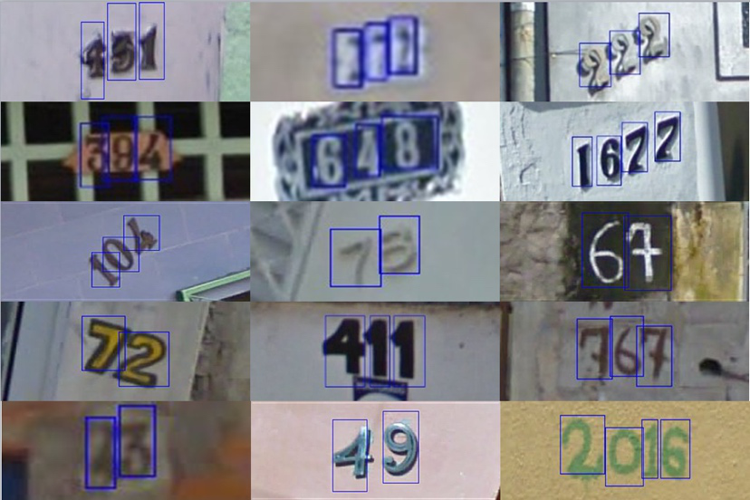
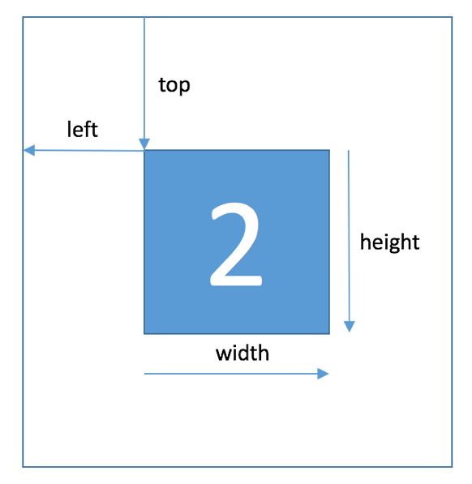
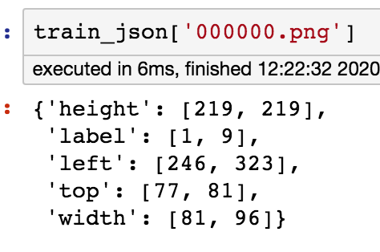
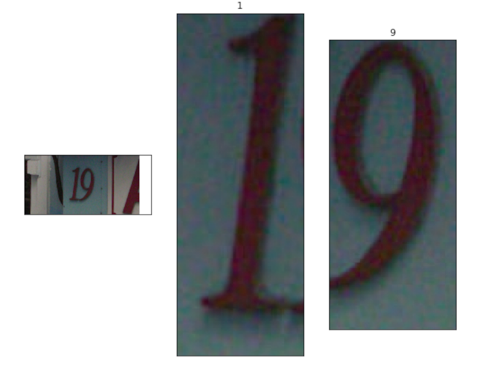
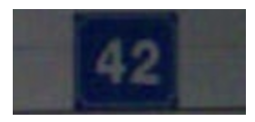
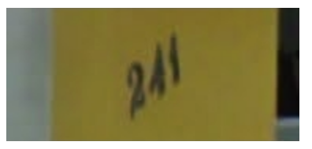
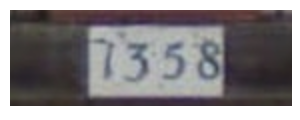
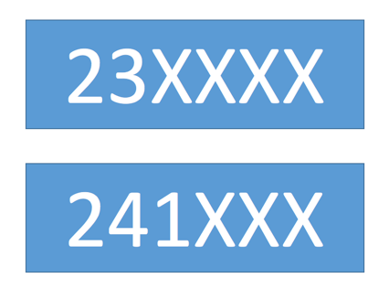
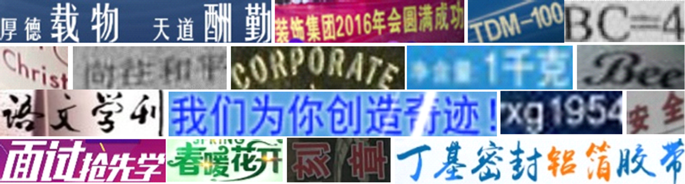
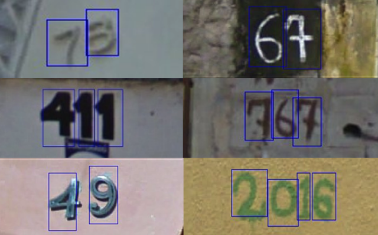

# Datawhale 零基础入门CV赛事-Task1 赛题理解
        
本章内容将会对街景字符识别赛题进行赛题背景讲解，对赛题数据的读取进行说明，并给出集中解题思路。    
        
## 1 赛题理解   
- 赛题名称：零基础入门CV之街道字符识别             
- 赛题目标：通过这道赛题可以引导大家走入计算机视觉的世界，主要针对竞赛选手上手视觉赛题，提高对数据建模能力。       
- 赛题任务：赛题以计算机视觉中字符识别为背景，要求选手预测街道字符编码，这是一个典型的字符识别问题。      
为了简化赛题难度，赛题数据采用公开数据集[SVHN](http://ufldl.stanford.edu/housenumbers/)，因此大家可以选择很多相应的paper作为思路参考。         
        
### 1.1 学习目标     
- 理解赛题背景和赛题数据     
- 完成赛题报名和数据下载，理解赛题的解题思路     

### 1.2 赛题数据      
赛题以街道字符为为赛题数据，数据集报名后可见并可下载，该数据来自收集的SVHN街道字符，并进行了匿名采样处理。  


             
注意: 按照比赛规则，所有的参赛选手只能使用比赛给定的数据集完成训练，不能使用SVHN原始数据集进行训练。比赛结束后将会对Top选手进行代码审核，违规的选手将清除排行榜成绩。
         
训练集数据包括3W张照片，验证集数据包括1W张照片，每张照片包括颜色图像和对应的编码类别和具体位置；为了保证比赛的公平性，测试集A包括4W张照片，测试集B包括4W张照片。
       
需要注意的是本赛题需要选手识别图片中所有的字符，为了降低比赛难度，我们提供了训练集、验证集中所有字符的位置框。
    
### 1.3 数据标签      
对于训练数据每张图片将给出对于的编码标签，和具体的字符框的位置（训练集、验证集都给出字符位置），可用于模型训练：
 Field  | Description|
--------- | --------|
top	| 左上角坐标X |
height	| 字符高度 |
left   | 左上角最表Y |
width  | 字符宽度 |
label  | 字符编码 |
      
字符的坐标具体如下所示：     
     
     
 在比赛数据（训练集和验证集）中，同一张图片中可能包括一个或者多个字符，因此在比赛数据的JSON标注中，会有两个字符的边框信息：      
 |原始图片|图片JSON标注|
 |----|-----|
     |   |
 
 ### 1.4 评测指标     
 选手提交结果与实际图片的编码进行对比，以编码整体识别准确率为评价指标。任何一个字符错误都为错误，最终评测指标结果越大越好，具体计算公式如下：     
                                              Score=编码识别正确的数量/测试集图片数量        
     
 ### 1.5 读取数据    
 为了方便大家进行数据读取，在此我们给出JSON中标签的读取方式：  
      
 ```python
 import json
train_json = json.load(open('../input/train.json'))

# 数据标注处理
def parse_json(d):
    arr = np.array([
        d['top'], d['height'], d['left'],  d['width'], d['label']
    ])
    arr = arr.astype(int)
    return arr

img = cv2.imread('../input/train/000000.png')
arr = parse_json(train_json['000000.png'])

plt.figure(figsize=(10, 10))
plt.subplot(1, arr.shape[1]+1, 1)
plt.imshow(img)
plt.xticks([]); plt.yticks([])

for idx in range(arr.shape[1]):
    plt.subplot(1, arr.shape[1]+1, idx+2)
    plt.imshow(img[arr[0, idx]:arr[0, idx]+arr[1, idx],arr[2, idx]:arr[2, idx]+arr[3, idx]])
    plt.title(arr[4, idx])
    plt.xticks([]); plt.yticks([])
```     
     
        
### 1.6 解题思路      
赛题思路分析：赛题本质是分类问题，需要对图片的字符进行识别。但赛题给定的数据图片中不同图片中包含的字符数量不等，如下图所示。有的图片的字符个数为2，有的图片字符个数为3，有的图片字符个数为4。      
       
  |字符属性|图片|
 |----|-----|
 |字符：42   字符个数：2    |   |
 |字符：241   字符个数：3    |   |
 |字符：7358   字符个数：4    |   |
  
因此本次赛题的难点是需要对不定长的字符进行识别，与传统的图像分类任务有所不同。为了降低参赛难度，我们提供了一些解题思路供大家参考：     
      
- 简单入门思路：定长字符识别    
     
可以将赛题抽象为一个定长字符识别问题，在赛题数据集中大部分图像中字符个数为2-4个，最多的字符    个数为6个。                 
因此可以对于所有的图像都抽象为6个字符的识别问题，字符23填充为23XXXX，字符231填充为231XXX。      
   

经过填充之后，原始的赛题可以简化了6个字符的分类问题。在每个字符的分类中会进行11个类别的分类，假如分类为填充字符，则表明该字符为空。         
- 专业字符识别思路：不定长字符识别 
        
      
            
在字符识别研究中，有特定的方法来解决此种不定长的字符识别问题，比较典型的有CRNN字符识别模型。     
在本次赛题中给定的图像数据都比较规整，可以视为一个单词或者一个句子。   

- 专业分类思路：检测再识别     
      
在赛题数据中已经给出了训练集、验证集中所有图片中字符的位置，因此可以首先将字符的位置进行识别，利用物体检测的思路完成。        
      
           
            
此种思路需要参赛选手构建字符检测模型，对测试集中的字符进行识别。选手可以参考物体检测模型SSD或者YOLO来完成。    
     
### 1.7 本章小节       
综上所示，本次赛题虽然是一个简单的字符识别问题，但有多种解法可以使用到计算机视觉领域中的各个模型，是非常适合大家入门学习的。         
三种解决思路的难度从低到高，因此建议入门学习的同学可以先学习定长字符识别的思路。在文档之后的内容中我们也会以定长字符识别为例，让大家逐渐入门计算机视觉。

