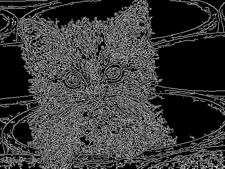
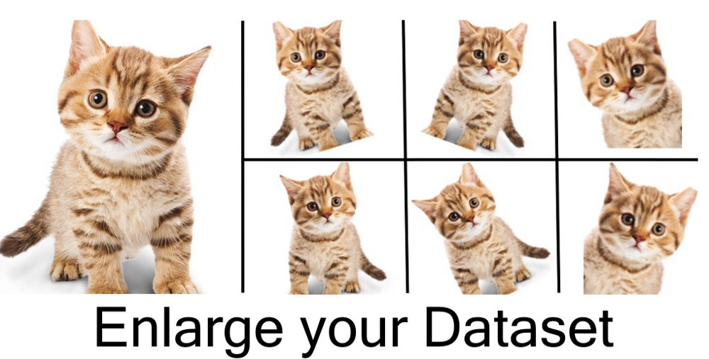
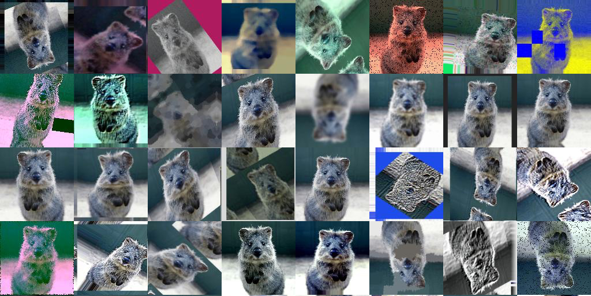

# Datawhale 零基础入门CV赛事-Task2 数据读取与数据扩增
       
在上一章节，我们给大家讲解了赛题的内容和三种不同的解决方案。从本章开始我们将逐渐的学习使用【定长字符识别】思路来构建模型，逐步讲解赛题的解决方案和相应知识点。     
      
## 2 数据读取与数据扩增     
本章主要内容为数据读取、数据扩增方法和Pytorch读取赛题数据三个部分组成。     
       
### 2.1 学习目标     
- 学习Python和Pytorch中图像读取    
- 学会扩增方法和Pytorch读取赛题数据
      
### 2.2 图像读取           
由于赛题数据是图像数据，赛题的任务是识别图像中的字符。因此我们首先需要完成对数据的读取操作，在Python中有很多库可以完成数据读取的操作，比较常见的有Pillow和OpenCV。     
    
#### 2.2.1 Pillow     
Pillow是Python图像处理函式库(PIL）的一个分支。Pillow提供了常见的图像读取和处理的操作，而且可以与ipython notebook无缝集成，是应用比较广泛的库。            
|效果|  代码 |
|----|-----|
|   |   from PIL import Image<br># 导入Pillow库<br> <br> # 读取图片<br>im =Image.open(cat.jpg') |
|   |   from PIL import Image, ImageFilter<br>im = Image.open('cat.jpg')<br> # 应用模糊滤镜:<br>im2 = im.filter(ImageFilter.BLUR)<br>im2.save('blur.jpg', 'jpeg') |
|   |   from PIL import Image<br># 打开一个jpg图像文件，注意是当前路径:<br> im = Image.open('cat.jpg')<br>im.thumbnail((w//2, h//2))<br>im.save('thumbnail.jpg', 'jpeg') |
                                          
当然上面只演示了Pillow最基础的操作，Pillow还有很多图像操作，是图像处理的必备库。       
Pillow的官方文档：https://pillow.readthedocs.io/en/stable/
     
#### 2.2.2 OpenCV           
OpenCV是一个跨平台的计算机视觉库，最早由Intel开源得来。OpenCV发展的非常早，拥有众多的计算机视觉、数字图像处理和机器视觉等功能。OpenCV在功能上比Pillow更加强大很多，学习成本也高很多。 
|效果|  代码 |
|----|-----|
|   |  import cv2<br># 导入Opencv库<br>img = cv2.imread('cat.jpg')<br># Opencv默认颜色通道顺序是BRG，转换一下<br>img = cv2.cvtColor(img, cv2.COLOR_BGR2RGB)  |
|   |  import cv2<br># 导入Opencv库<br>img = cv2.imread('cat.jpg')<br>img = cv2.cvtColor(img, cv2.COLOR_BGR2GRAY)<br># 转换为灰度图  |
|   |  import cv2<br># 导入Opencv库<br>img = cv2.imread('cat.jpg')<br>img =cv2.cvtColor(img, cv2.COLOR_BGR2GRAY)<br># 转换为灰度图<br># Canny边缘检测<br>edges = cv2.Canny(img, 30, 70)<br>cv2.imwrite('canny.jpg', edges)  |

       
OpenCV包含了众多的图像处理的功能，OpenCV包含了你能想得到的只要与图像相关的操作。此外OpenCV还内置了很多的图像特征处理算法，如关键点检测、边缘检测和直线检测等。       
OpenCV官网：https://opencv.org/       
OpenCV Github：https://github.com/opencv/opencv      
OpenCV 扩展算法库：https://github.com/opencv/opencv_contrib
       
### 2.3 数据扩增方法          
在上一小节中给大家初步介绍了Pillow和OpenCV的使用，现在回到赛题街道字符识别任务中。在赛题中我们需要对的图像进行字符识别，因此需要我们完成的数据的读取操作，同时也需要完成数据扩增（Data Augmentation）操作。     
       
#### 2.3.1 数据扩增介绍      
在深度学习中数据扩增方法非常重要，数据扩增可以增加训练集的样本，同时也可以有效缓解模型过拟合的情况，也可以给模型带来的更强的泛化能力。
      

          
- #### 数据扩增为什么有用？      
在深度学习模型的训练过程中，数据扩增是必不可少的环节。现有深度学习的参数非常多，一般的模型可训练的参数量基本上都是万到百万级别，而训练集样本的数量很难有这么多。       
其次数据扩增可以扩展样本空间，假设现在的分类模型需要对汽车进行分类，左边的是汽车A，右边为汽车B。如果不使用任何数据扩增方法，深度学习模型会从汽车车头的角度来进行判别，而不是汽车具体的区别。     
      
   
                   
- #### 有哪些数据扩增方法？            
数据扩增方法有很多：从颜色空间、尺度空间到样本空间，同时根据不同任务数据扩增都有相应的区别。        
对于图像分类，数据扩增一般不会改变标签；对于物体检测，数据扩增会改变物体坐标位置；对于图像分割，数据扩增会改变像素标签。     
        
#### 2.3.2 常见的数据扩增方法     
在常见的数据扩增方法中，一般会从图像颜色、尺寸、形态、空间和像素等角度进行变换。当然不同的数据扩增方法可以自由进行组合，得到更加丰富的数据扩增方法。         

以torchvision为例，常见的数据扩增方法包括：

- transforms.CenterCrop      对图片中心进行裁剪      
- transforms.ColorJitter      对图像颜色的对比度、饱和度和零度进行变换      
- transforms.FiveCrop     对图像四个角和中心进行裁剪得到五分图像     
- transforms.Grayscale      对图像进行灰度变换    
- transforms.Pad        使用固定值进行像素填充     
- transforms.RandomAffine      随机仿射变换    
- transforms.RandomCrop      随机区域裁剪     
- transforms.RandomHorizontalFlip      随机水平翻转     
- transforms.RandomRotation     随机旋转     
- transforms.RandomVerticalFlip     随机垂直翻转   
      
     
       
在本次赛题中，赛题任务是需要对图像中的字符进行识别，因此对于字符图片并不能进行翻转操作。比如字符6经过水平翻转就变成了字符9，会改变字符原本的含义。    
   
#### 2.3.3 常用的数据扩增库     
- #### torchvision      
https://github.com/pytorch/vision      
pytorch官方提供的数据扩增库，提供了基本的数据数据扩增方法，可以无缝与torch进行集成；但数据扩增方法种类较少，且速度中等；       
        
- #### imgaug         
https://github.com/aleju/imgaug      
imgaug是常用的第三方数据扩增库，提供了多样的数据扩增方法，且组合起来非常方便，速度较快；      
       
- #### albumentations       
https://albumentations.readthedocs.io      
是常用的第三方数据扩增库，提供了多样的数据扩增方法，对图像分类、语义分割、物体检测和关键点检测都支持，速度较快。      
      
## 2.4 Pytorch读取数据    
由于本次赛题我们使用Pytorch框架讲解具体的解决方案，接下来将是解决赛题的第一步使用Pytorch读取赛题数据。       
在Pytorch中数据是通过Dataset进行封装，并通过DataLoder进行并行读取。所以我们只需要重载一下数据读取的逻辑就可以完成数据的读取。      
      
```python
import os, sys, glob, shutil, json
import cv2

from PIL import Image
import numpy as np

import torch
from torch.utils.data.dataset import Dataset
import torchvision.transforms as transforms

class SVHNDataset(Dataset):
    def __init__(self, img_path, img_label, transform=None):
        self.img_path = img_path
        self.img_label = img_label 
        if transform is not None:
            self.transform = transform
        else:
            self.transform = None

    def __getitem__(self, index):
        img = Image.open(self.img_path[index]).convert('RGB')

        if self.transform is not None:
            img = self.transform(img)
        
        # 原始SVHN中类别10为数字0
        lbl = np.array(self.img_label[index], dtype=np.int)
        lbl = list(lbl)  + (5 - len(lbl)) * [10]
        
        return img, torch.from_numpy(np.array(lbl[:5]))

    def __len__(self):
        return len(self.img_path)

train_path = glob.glob('../input/train/*.png')
train_path.sort()
train_json = json.load(open('../input/train.json'))
train_label = [train_json[x]['label'] for x in train_json]

data = SVHNDataset(train_path, train_label,
          transforms.Compose([
              # 缩放到固定尺寸
              transforms.Resize((64, 128)),

              # 随机颜色变换
              transforms.ColorJitter(0.2, 0.2, 0.2),

              # 加入随机旋转
              transforms.RandomRotation(5),

              # 将图片转换为pytorch 的tesntor
              # transforms.ToTensor(),

              # 对图像像素进行归一化
              # transforms.Normalize([0.485,0.456,0.406],[0.229,0.224,0.225])
            ]))
```    
通过上述代码，可以将赛题的图像数据和对应标签进行读取，在读取过程中的进行数据扩增，效果如下所示：       
|1|2|3|      
|----|-----|------|          
| | | |
| | | |
      
接下来我们将在定义好的Dataset基础上构建DataLoder，你可以会问有了Dataset为什么还要有DataLoder？其实这两个是两个不同的概念，是为了实现不同的功能。                 
- Dataset：对数据集的封装，提供索引方式的对数据样本进行读取      
- DataLoder：对Dataset进行封装，提供批量读取的迭代读取    
       
 加入DataLoder后，数据读取代码改为如下：      
```python
import os, sys, glob, shutil, json
import cv2

from PIL import Image
import numpy as np

import torch
from torch.utils.data.dataset import Dataset
import torchvision.transforms as transforms

class SVHNDataset(Dataset):
    def __init__(self, img_path, img_label, transform=None):
        self.img_path = img_path
        self.img_label = img_label 
        if transform is not None:
            self.transform = transform
        else:
            self.transform = None

    def __getitem__(self, index):
        img = Image.open(self.img_path[index]).convert('RGB')

        if self.transform is not None:
            img = self.transform(img)
        
        # 原始SVHN中类别10为数字0
        lbl = np.array(self.img_label[index], dtype=np.int)
        lbl = list(lbl)  + (5 - len(lbl)) * [10]
        
        return img, torch.from_numpy(np.array(lbl[:5]))

    def __len__(self):
        return len(self.img_path)

train_path = glob.glob('../input/train/*.png')
train_path.sort()
train_json = json.load(open('../input/train.json'))
train_label = [train_json[x]['label'] for x in train_json]

train_loader = torch.utils.data.DataLoader(
        SVHNDataset(train_path, train_label,
                   transforms.Compose([
                       transforms.Resize((64, 128)),
                       transforms.ColorJitter(0.3, 0.3, 0.2),
                       transforms.RandomRotation(5),
                       transforms.ToTensor(),
                       transforms.Normalize([0.485, 0.456, 0.406], [0.229, 0.224, 0.225])
            ])), 
    batch_size=10, # 每批样本个数
    shuffle=False, # 是否打乱顺序
    num_workers=10, # 读取的线程个数
)

for data in train_loader:
    break
```    
           
在加入DataLoder后，数据按照批次获取，每批次调用Dataset读取单个样本进行拼接。此时data的格式为：       
                ``` torch.Size([10, 3, 64, 128]), torch.Size([10, 6]) ```          
前者为图像文件，为batchsize * chanel * height * width次序；后者为字符标签。      

## 2.5 本章小节       
本章对数据读取进行了详细的讲解，并介绍了常见的数据扩增方法和使用，最后使用Pytorch框架对本次赛题的数据进行读取。    

     

