# CS224n Note-01

> 作者：浩浩雷

## Lecture 1: Introduction and Word Vectors

School：Stanford

Teacher：Prof. Christopher Manning

Library：Pytorch

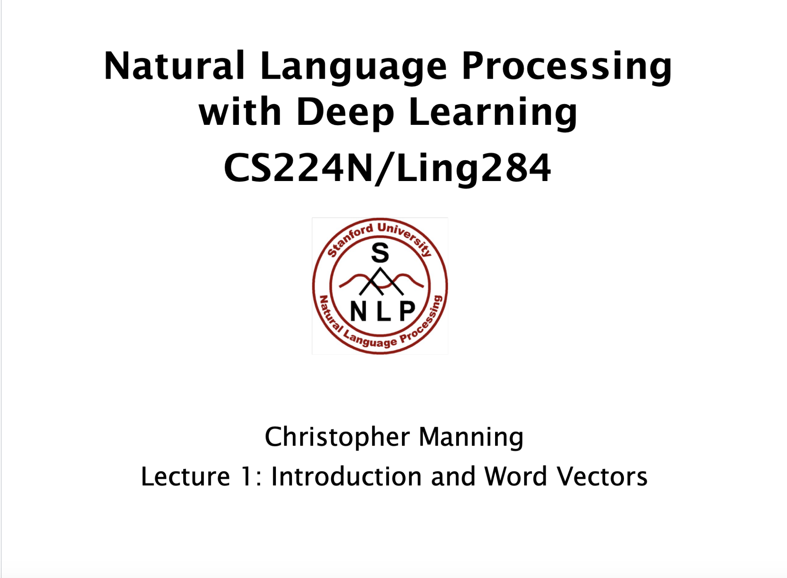

**内容目录**

- 语言学到自然语言处理简要介绍
- 人类语言和单词含义
- 词向量
- Word2vec语言模型的简要介绍
- 优化简介：梯度下降

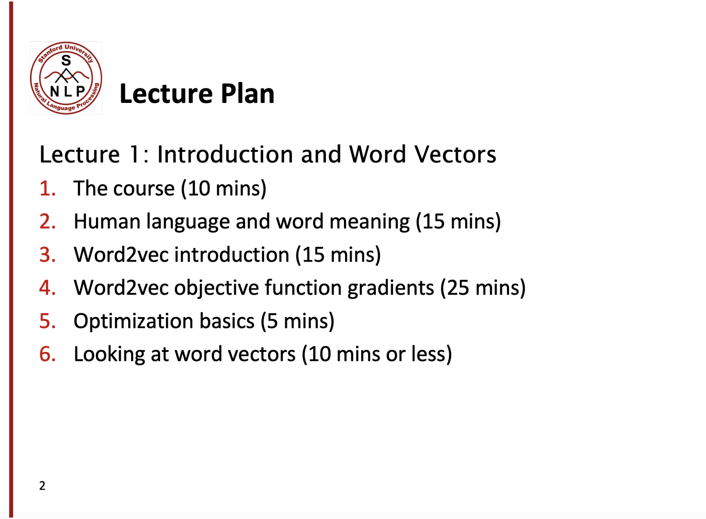

**课程目标**

- 理解目前深度学习处理方法（包括NLP主流模型和方法）
- 了解NLP中的处理问题
- NLP中主流问题的建模和处理能力（in Pytorch）

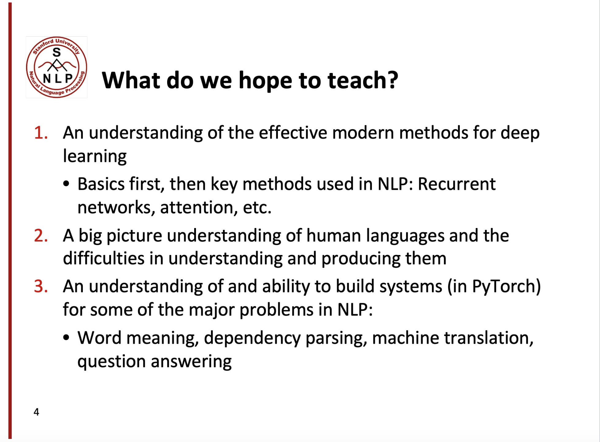

### 1. The course

人类比猩猩更加聪明，是因为人们可以通过语言进行交互，对语言的理解和思考，展现了人类语言的复杂和高效。

每个人对于语言都可以有自己的理解，因此语言不光具有信息传递的功能，还可以通过语言来影响其他人。

当今社会，网络速度不断更新迭代，5G已经油然而生，相对于人类语言，我们使用NLP技术可以高速学习构建更强大的处理能力。

NLP就是对各种文本内容进行处理。


### 2. Human language and word meaning

***How do we represent the meaning of a word?***

定义meaning：

- 用单词、词组表示概念

- 人们运用单词、符号表示自己的观点

- 通过写作作品、艺术来表达观

- 理解含义最普遍的语言方式（denotational semantics用语言符号对语义进行转化）：

  signifier(symbol)⇔signified(idea or thing) 


***How do we have usable meaning in a computer?***

通常的解决方案：Wordnet（包含同义词集和上位词的一个巨大词典）

｜上位词：用 “is a”来表示关系的词集列表

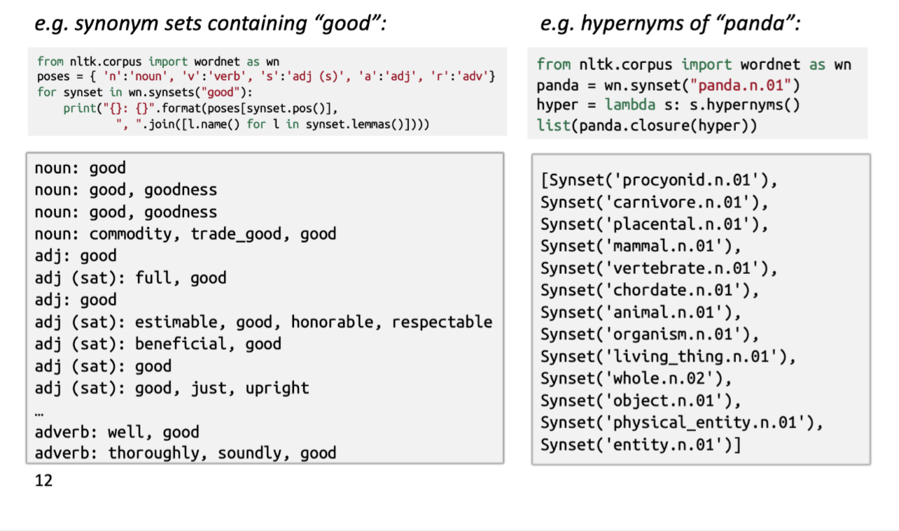


***Problems with resources like WordNet***

Wordnet的劣势：

- 是很好的资源但忽略了细微的一些差别：例如词典中‘proficient’与‘good’认为是同义词，但是这只在某些文本上下文中成立。
- 忽略了一些单词的含义（即含义不完整）
- 偏主观（缺少客观性）
- 需要人类来不断地更新和改写
- 无法计算单词之间的相似度


***Representing words as discrete symbols***

传统NLP中，我们将单词看作是离散的表示，通过one-hot vector来表示。


One-hot vector表示，由于向量是正交的，因此没法表示他们之间啊的相似度，如果词汇量太多，将使得向量的维度过大。


***Representing words by their context***

Distributional semantics：一个单词的含义通常由在它附近经常出现的单词给出的。

- 对于文本中的一个单词*w*，它的上下文就是出现在它附近的一组单词（在一个划定好size的窗口下）

- 通过许多包含*w*的文本中的上下文来构建*w*的含义表示：

  

### 3. Word2vec introduction

***Word vectors***

我们将为每个单词构建一个稠密的向量，使得它能够与相似文本里的词向量相近，word meaning 作为一种神经词向量，在我们对向量空间进行可视化：

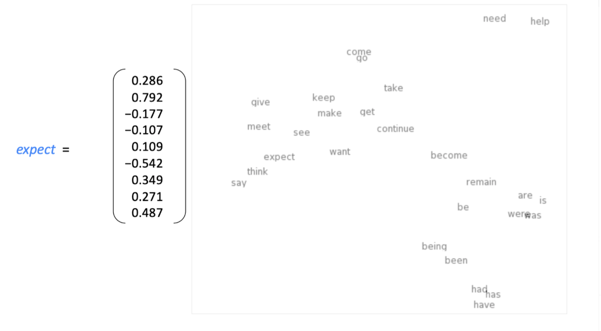

注：word vector 有时也叫做 word embedding 或者 word representations，他们都是一种表示结构。


***Word2vec：Overview***

*Word2vec*(Mikolov et al. 2013) 是一种学习词向量的框架

- 包含大量的文本语料

- 固定词表中的每一个单词由一个词向量表示

- 文本中的每个单词位置 *t*，有一个中心词*c*，和它的上下文 *o*（除了 *c* 的外部单词）。

- 通过 *c* 和 *o* 的词向量相似性来计算 *P（o/c）* 

- 不断的调整词向量，最大化概率

  固定窗口，滑动窗口并计算：

  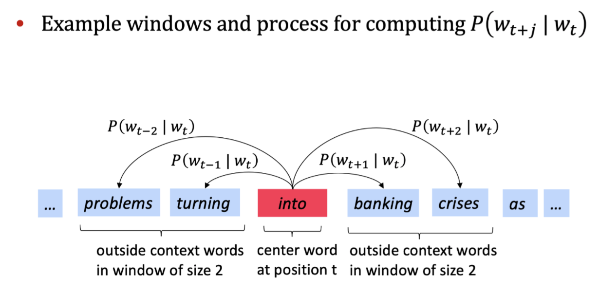

  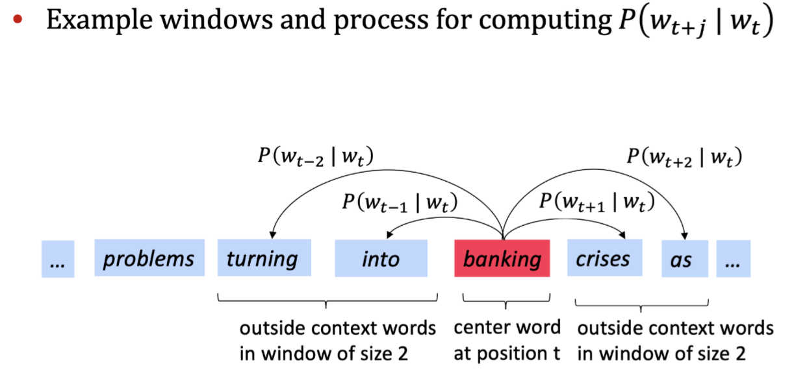

  

***Word2vec的目标函数***：

对于每个位置 *t* = 1,...,T，固定窗口大小m，给定中心词*w*<sub>j</sub>:

$$
likelihood=L(\theta)=\prod_{t=1}^{T}\prod_{-m \le j \le m\\ \ \ \ \ j\ne0}^{}p(w_{t+j}|w_t;\theta)
$$

注：$ \theta $ 是需要优化的参数


$$
J（\theta）=-\frac 1TlogL(\theta)=-\frac1T\sum_{t=1}^T\sum_{-m\le j\le m \\  \ \ \ \  j\ne 0}logP(w_{t+j}|w_t;\theta) 
$$
注：

- $J(\theta)$为损失函数（这里是平均负对数似然）；
- 负号将极大化损失函数转化为极小化损失函数；
- log函数方便将乘法转化为求和（优化处理）


***如何计算？***

- 问：如何计算$P(w_{t+j}|w_t;\theta)$?

- 答：对于每个单词 *w* 我们使用两个向量 $v_w$ 和 $u_w$

  $v_w$ ：当 *w* 是中心词时

  $u_w$ ：当 *w* 是上下文单词时

- 对于中心词 *c* 和上下文单词 *o*，有：
  $$
  P(o|c)=\frac {exp(u_o^Tv_c)}{\sum_{w\epsilon V}exp(u_w^Tv_c)}
  $$

****

***Example***：

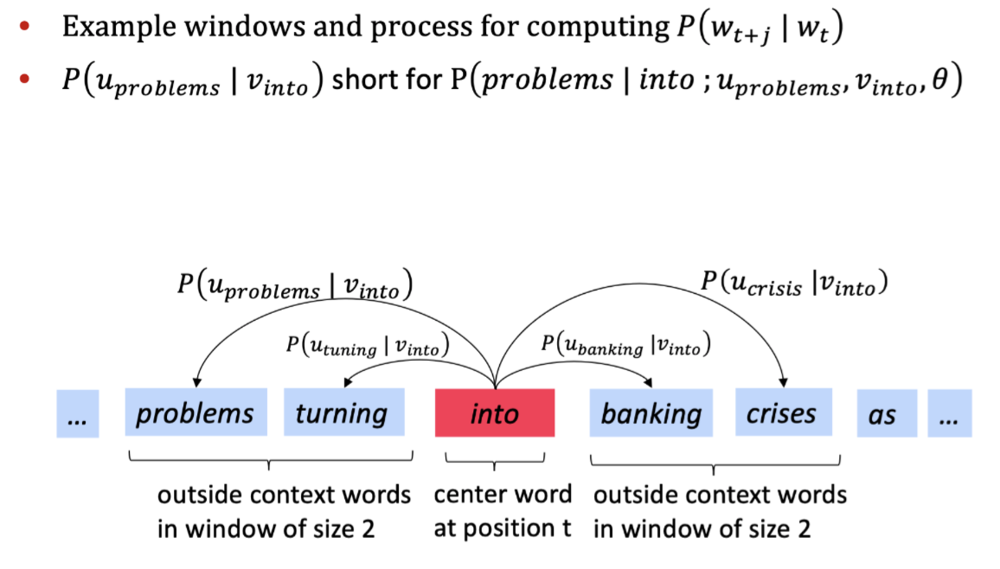


在概率函数中：
$$
P(o|c)=\frac {exp(u_o^Tv_c)}{\sum_{w\epsilon V}exp(u_w^Tv_c)}
$$


- 分子取幂函数使得始终可以为正
- 向量 $u_o$ 和向量 $v_c$ 点乘，点乘结果越大，向量之间越相似
- $u^Tv=u·v=\sum_{i=1}^nu_iv_i$
- 对整个词表标准化，给出概率分布


***softmax函数进行归一化***（深度学习中常用）： $\Bbb{R^n}\to \Bbb{R^n}$
$$
softmax（x）= \frac {exp(x_i)}{\sum_{j=1}^nexp(x_j)}=p_i
$$
注：用于将任意值 $x_i$ 映射到概率分布 $p_i$


### 4. Word2vec objective function gradients

***Training a model by optimizing parameters***

（通过优化参数的方式训练模型）- 最小化损失

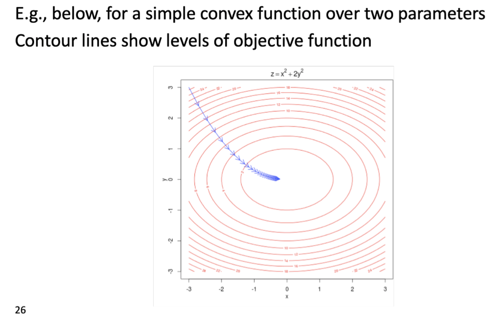


***To train the model: Compute all vector gradients***

整个模型里只有一个参数 $\theta$ ,所以我们只用优化这一个参数就行。

例如：模型在一个 d 维，词典大小为 V :
$$
\theta=\begin{bmatrix}v_{aardvark}\\v_a\\\vdots\\v_{zebra}\\u_{aardvark}\\u_a\\\vdots\\u_{zebra} \end{bmatrix}\epsilon\ \Bbb R^{2dV}
$$

- 2：每个单词有两个向量
- 通过梯度（导数）下降的方式优化参数
- 梯度下降会用到链式法则
- 迭代计算每个中心词向量和上下文词向量随着滑动窗口移动的梯度
- 依次迭代更新窗口中所有的参数

***Example***：

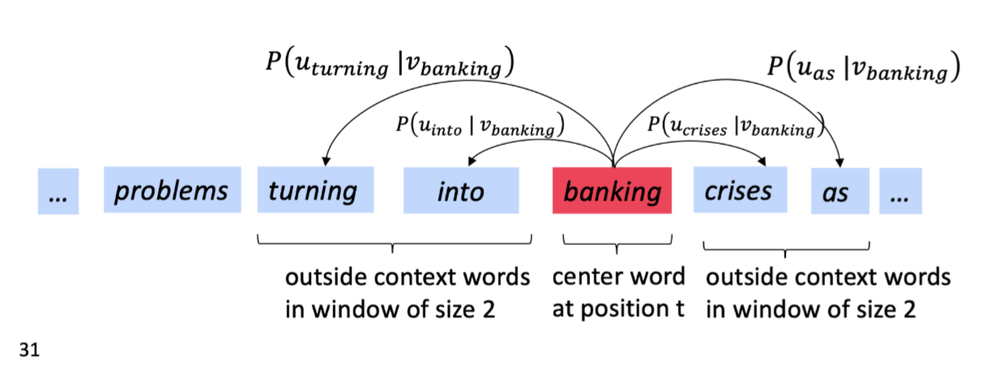


***计算手稿***：

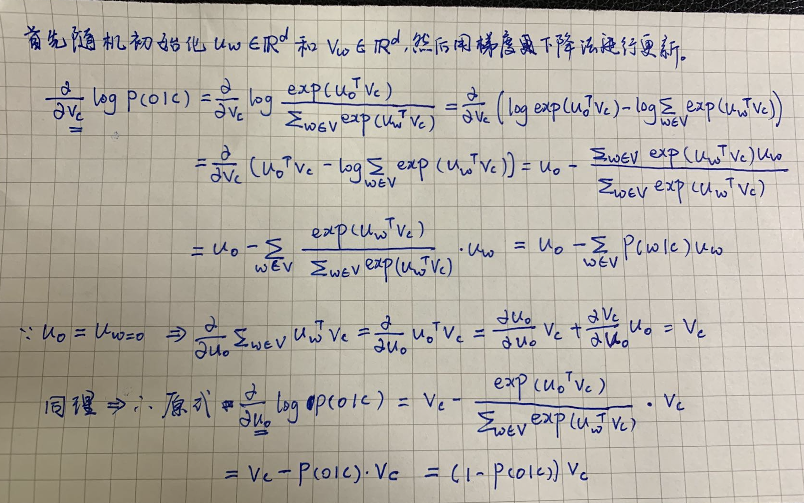


### 5. Optimization basics

***Optimization：Gradient Descent***（梯度下降）

- 我们的损失函数 $J(\theta)$ 需要最小化

- 使用的方法为：梯度下降

- 对于当前 $\theta$ ,计算 $J(\theta)$ 的梯度

- 然后小步重复朝着负梯度方向更新方程里的参数 $\alpha=(step\ size)\ or\ (learning\ rate)$  
  $$
  \theta^{new}=\theta^{old}-\alpha \nabla_\theta J(\theta)
  $$


- 更新唯一的参数 $\theta$:
  $$
  \theta_j^{new}=\theta_j^{old}-\alpha \frac \alpha{\alpha\  \theta_j^{old}}J(\theta)
  $$

```python
while True:
	theta_grad = evaluate_gradient(J,corpus,theta)
  theta = theta - alpha * theta_grad
```


***SGD:Stochastic Gradient Descent***

- 由于 $J(\theta)$ 是在语料文本中所有窗口的方程

- 当语料很大的时候，计算梯度会消耗巨大

- 解决办法：SGD

- 不断sample窗口，不断更新

  ```python
  while True:
    window = sample_window(corpus)
    theta_grad = evaluate_gradient(J,window,theta)
    theta = tehta - alpha * theta_grad
  ```

  


