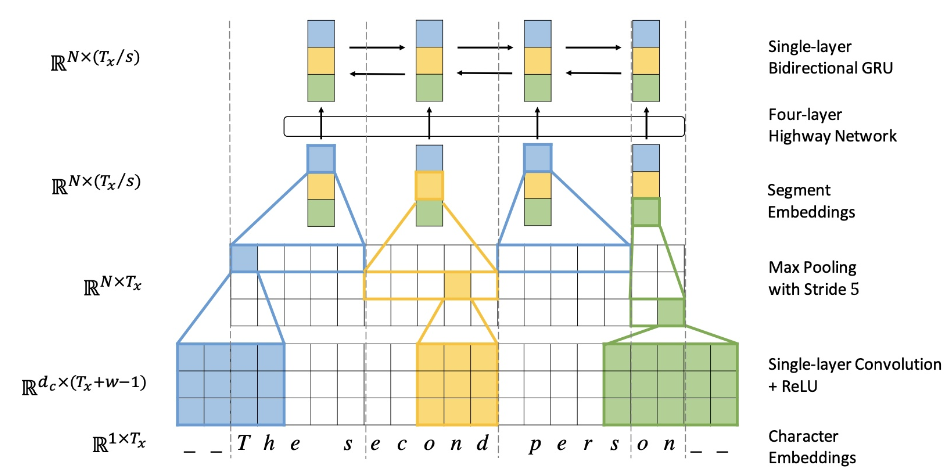

# 12-Subword Models 读书笔记

## 前言

之前的 word2vec 和 glove 基本上都是基于word单词作为基本单位的，这种方式虽然能够很好的对词库中每一个词进行向量表示，然而，这种方式容易出现单词不存在于词汇库中的情况，也就是 OOV(out-of-vocabulary),而且对于单词的一些词法上的修饰(morphology)处理的也不是很好。一个自然的想法就是能够利用比word更基本的组成来建立模型，以更好的解决这些问题。本节思考采用 n-gram 思想训练 word vector 模型，也就是 FastText。

## 动机

### word-level Model

#### 介绍

基于word单词作为基本单位的，这种方式虽然能够很好的对词库中每一个词进行向量表示。

#### 问题

1. OOV 问题。
   - 问题描述：容易出现单词不存在于词汇库中的情况；
   - 解决方法：最佳语料规模，使系统能够获得更多的词汇量；
2. 误拼障碍。
   - 问题描述：如果遇到了不正式的拼写, 系统很难进行处理；
   - 解决方法：矫正或加规则约束；
3. 做翻译问题时, 音译姓名比较难做到。

### Character-Level Model

#### 介绍

基于 Character 作为基本单位的，这种方式虽然能够很好的对字库中每一个 Char 进行向量表示。

#### 优点

1. 能够解决 Word-level 所存在的 OOV 问题；
2. 拼写类似的单词 具有类似的 embedding；

#### 问题

1. 序列变长
   - 相比于 word-level , Character-level 的输入句子变长，使得数据变得稀疏，而且对于远距离的依赖难以学到，训练速度降低；
   - 解决方法： 

       Lee 等 提出了利用多层 conv 和 pooling 和 highway layer 的方式来解决该问题，其结构如下所示：

       

       该论文的思路如下所示：

       1. 输入的字符首先需要经过 Character embedding 层，并被转化为 character embeddings 表示；
       2. 采用 不同窗口大小的卷积核对输入字符的 character embeddings 表示进行卷积操作，论文中采用的窗口的大小分别为 3、4、5 ，也就是说学习 Character-level 的 3-gram、4-gram、5-gram;
       3. 对不同卷积层的卷积结果进行 max-pooling 操作，即捕获其最显著特征生成 segment embedding;
       4. segment embedding 经过 Highway Network (有些类似于Residual network，方便深层网络中信息的流通，不过加入了一些控制信息流量的gate）；
       5. 输出结果 再经过 单层 BiGRU，得到最终 的 encoder output;
       6. 之后，decoder再利用Attention机制以及character level GRU进行decode

       通过这种方式不仅能够解决 Word-level 所存在的 OOV 问题，而且能够捕获 句子的 3-gram、4-gram、5-gram 信息，这个也是 后期 FastText 的想法雏形；

### 想法

针对该问题，思考能不能换一个角度来表示语言呢. 说英文的时候, 每个单词都是由音节构成的, 而人们听到了连续的音节就可以理解其中的含义, 而音节显然比词粒度更细。


## Subword Model

### 引言

居然 word-level Model 和 Character-level Model 各有优缺点，那么是否能够 采用 一种介于 word-level Model 和 Character-level 之间的 Model 呢？ 针对该想法有了 Subword Model.

### Subword Model

#### 类别

Subword Model 可以被分为 Byte Pair Encoding（BPE） 和 SentencePiece。

##### Byte Pair Encoding（BPE）

###### 基本思路

BPE 属于 压缩算法中一种，其主要思想就是将经常出现的byte pair用一个新的byte来代替，例如假设('A', ’B‘）经常顺序出现，则用一个新的标志'AB'来代替它们。

###### 具体操作

给定了文本库，我们的初始词汇库仅包含所有的单个的字符，然后不断的将出现频率最高的 n-gram pair 作为新的n-gram加入到词汇库中，直到词汇库的大小达到我们所设定的某个目标为止。

###### 举例说明

假设我们的文本库中出现的单词及其出现次数为：

```
    {'l o w': 5, 'l o w e r': 2, 'n e w e s t': 6, 'w i d e s t': 3}
```

初始词汇库为:

```
    { 'l', 'o', 'w', 'e', 'r', 'n', 'w', 's', 't', 'i', 'd'}
```

出现频率最高的ngram pair是('e','s') 9次，所以我们将'es'作为新的词汇加入到词汇库中，由于'es'作为一个整体出现在词汇库中，


此时，文本库可表示为 

```
    {'l o w': 5, 'l o w e r': 2, 'n e w es t': 6, 'w i d es t': 3}
```

这时出现频率最高的ngram pair是('es','t') 9次，将'est'加入到词汇库中，文本库更新为

```
   {'l o w': 5, 'l o w e r': 2, 'n e w est': 6, 'w i d est': 3}
```

新的出现频率最高的ngram pair是('l','o')7次，将'lo'加入到词汇库中，文本库更新为

```
   {'lo w': 5, 'lo w e r': 2, 'n e w est': 6, 'w i d est': 3}
```

以此类推，直到词汇库大小达到我们所设定的目标。这个例子中词汇量较小，对于词汇量很大的实际情况，我们就可以通过BPE逐步建造一个较小的基于subword unit的词汇库来表示所有的词汇。

###### BPE 衍生物 wordpiece model 

谷歌的NMT模型用了BPE的变种，称作wordpiece model，BPE中利用了n-gram count来更新词汇库，而wordpiece model中则用了一种贪心算法来最大化语言模型概率，即选取新的n-gram时都是选择使得perplexity减少最多的ngram。

##### sentencepiece model

###### 基本思路

sentencepiece model 将词间的空白也当成一种标记，可以直接处理sentence，而不需要将其pre-tokenize成单词。

### Hybrid Model

#### 基本思路

在大多数情况下我们还是采用word level模型，而只在遇到OOV的情况才采用character level模型。

其结构如下图所示，


对于句子中的 "cute"，其属于 OOV 词汇，为了解决该问题，我们需要构建一个 Character-level 表示，但在 decode 过程中遇到 OOV 的特殊符号表示 <unk> 时，需要采用 character-level 的 decode 进行 解码。

该训练过程是end2end的，不过损失函数是word部分与character level部分损失函数的加权叠加。

### FastText

#### 引言

在前面，我们已经介绍和比较了 word-level 和 character-level 的优缺点，并根据其特点，提出一种介于 word-level Model 和 Character-level 之间的 Model ——  Subword Model。

那么，我们可不可以采取类似于上面的subword的思路来产生更好的word embedding呢？

FAIR的FastText就是利用subword将word2vec扩充，有效的构建embedding。

#### 基本思想

将每个 word 表示成 bag of character n-gram 以及单词本身的集合，例如对于where这个单词和n=3的情况，它可以表示为 <wh,whe,her,ere,re>,<where> ，其中"<",">"为代表单词开始与结束的特殊标记。

假设对于word $w$ ，其n-gram集合用 $G_w$ 表示，每个n-gram的矢量表示为,则每个单词可以表示成其所有n-gram的矢量和的形式，而center word $w$ 与context word $c$ 的分数就可表示成


之后就可以按照经典的word2vec算法训练得到这些特征向量。

这种方式既保持了word2vec计算速度快的优点，又解决了遇到training data中没见过的oov word的表示问题，可谓一举两得。

## 参考

1. [Lee J, Cho K, Hofmann T. Fully character-level neural machine translation without explicit segmentation[J]. Transactions of the Association for Computational Linguistics, 2017, 5: 365-378.](https://www.mitpressjournals.org/doi/abs/10.1162/tacl_a_00067)

